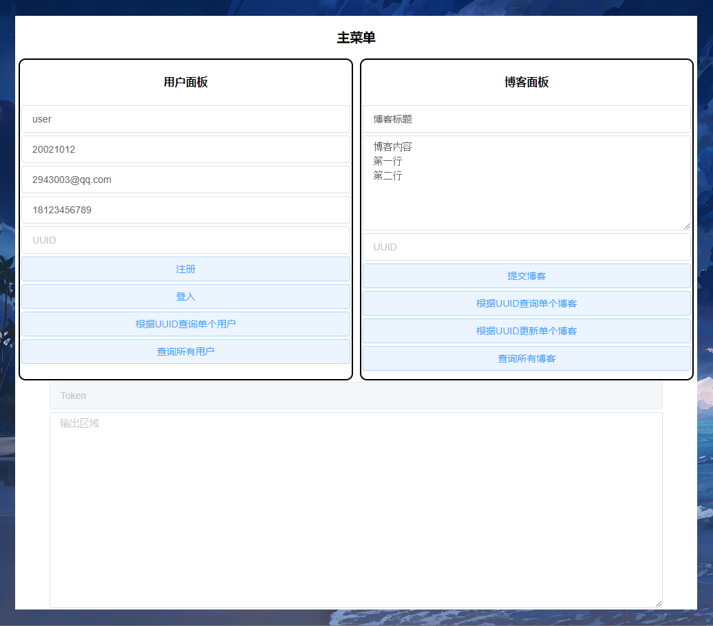
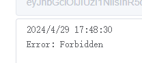
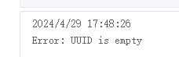

# 2024-BJTU-RESTful-API-Project
> 大三下 ZLG老师 实训课 个人作业
>
> 21301114 俞贤皓

- [2024-BJTU-RESTful-API-Project](#2024-bjtu-restful-api-project)
  - [1. 简介](#1-简介)
    - [1.1 技术路线](#11-技术路线)
    - [1.2 完成功能](#12-完成功能)
  - [2. 作业一，RESTful API 设计](#2-作业一restful-api-设计)
    - [2.1 用户API](#21-用户api)
      - [2.1.1 用户注册](#211-用户注册)
      - [2.1.2 用户登入](#212-用户登入)
      - [2.1.3 查询所有用户信息](#213-查询所有用户信息)
      - [2.1.4 查询单个用户信息](#214-查询单个用户信息)
    - [2.2 博客内容API](#22-博客内容api)
      - [2.2.1 添加博客](#221-添加博客)
      - [2.2.2 查询单个博客](#222-查询单个博客)
      - [2.2.3 查询所有博客](#223-查询所有博客)
      - [2.2.4 更新单个博客](#224-更新单个博客)
    - [2.3 第三方鉴权API](#23-第三方鉴权api)
    - [2.4 API工具说明](#24-api工具说明)
  - [3. 作业二，RESTful API 后端设计与实现](#3-作业二restful-api-后端设计与实现)
    - [3.1 技术路线](#31-技术路线)
    - [3.2 数据库表](#32-数据库表)
    - [3.3 第三方鉴权](#33-第三方鉴权)
    - [3.4 AI工具](#34-ai工具)
  - [4. 作业三，博客 前端的实现](#4-作业三博客-前端的实现)
    - [权限控制](#权限控制)
    - [AI工具](#ai工具)
  - [5. 作业四，作业二/三 集成测试的实现](#5-作业四作业二三-集成测试的实现)
    - [5.1 测试案例的设计](#51-测试案例的设计)
      - [5.1.1 前端](#511-前端)
      - [5.1.2 后端](#512-后端)
    - [5.2 后端的集成测试实现](#52-后端的集成测试实现)
      - [5.2.1 Controller Layer测试](#521-controller-layer测试)
      - [5.2.2 Service Layer测试](#522-service-layer测试)
    - [5.3 测试报告](#53-测试报告)
      - [5.3.1 自动测试结果](#531-自动测试结果)
      - [5.3.2 手动测试结果](#532-手动测试结果)
      - [5.3.3 测试总结](#533-测试总结)
      - [5.3.4 系统改进总结](#534-系统改进总结)
      - [5.3.5 AI工具](#535-ai工具)

## 1. 简介

### 1.1 技术路线

* 后端：Golang
  * Web框架：gin
  * 数据库ORM：gorm
  * 鉴权工具：jwt
  * 权限工具：gorbac
  * 测试工具：testing
* 前端：Vue.js + JavaScript

### 1.2 完成功能

* 我完成了作业要求的 **所有** 基本功能和 **所有额外选作功能**
* 以下列出了我完成功能的基本信息。具体信息请见 **下文的作业内容**
* 作业1
  * 功能点
    * 【完成】用户注册以及登录场景
    * 【完成】博客或内容应用场景
    * 【完成】（额外选作功能）第三方鉴权 API
      * 我使用了jwt鉴权API、gorbac权限管理API
      * 我基于jwt和gorbac，实现了一个权限机制
        * Admin可以读写任何内容
        * User只能读取自己的用户数据（无法访问他人用户数据）
        * User能读取所有博客，但只能修改自己的博客
  * 要求
    * 【完成】Rest API 设计应包括，资源的标识，操作，权限，请求 payload, 应答 payload.
      * 所有API设计均为Restful风格，满足规范
    * 【完成】API 版本控制
      * 资源标识包含了版本信息，如 `v1`
    * 【完成】API 使用说明
      * API文档如文档第二节所示
* 作业2
  * 【完成】实现 restful API 后台应用
  * 【完成】用户鉴权信息需数据库保存
  * 【完成】内容管理信息需数据库保存
  * 建议采用 sping boot + spring security 实现
    * 我使用了 Go + Gin + GoRBAC
  * 【完成】（额外选作功能）第三方鉴权
    * 我使用了 Jwt
* 作业3
  * 【完成】实现前后分离调用作业 2 的 API
    * 使用Vue.js和Gin分别实现前端和后端
  
  * 【完成】建议采用 SPA, 相应式布局
    * 网页为SPA，可以根据页面自动调整网页和组件大小
  
  * 【完成】前端功能包括
    * 【完成】用户注册
    * 【完成】用户登录
    * 【完成】用户登录成功后的内容主页，主页需通过 rest api 调用后台资源，显示内容题目， 文字内容和图像内容。内容访问需设权限控制。
      * 网站会通过RESTfulAPI调用后端资源，显示内容题目、文字内容。
      * 内容访问也受到了上文描述一致的权限控制。
* 作业4
  * 【均完成】前端
    * 当后台服务未开启或连接失败时，系统是否提示用户稍后再试。
    * 当系统已登录状态，后台服务中断，系统是否尝试多次连接，time-out 后退出登录状态。
    * 系统针对 axios 返回结果，正确提示用户。
  * 【均完成】后端
    * service layer 是否能够 捕捉 dao 数据库操作的异常，处理异常，写入 log，向 controller layer 传递适合的错误信息。保证 service layer 不会将系统 exception 信息传递到 controller。
    * service layer 正常运行的测试
    * controller layer 正常运行测试
    * controller layer 是否对前端造成的错误准确返回（401，401.1，401.2，403.1，403.2， etc）, 是否屏蔽系统 exception msg 返回用户。
    * 后端中断后，前端登录的 session 信息是否保留恢复，系统的运行信息是否可恢复。
  

## 2. 作业一，RESTful API 设计

### 2.1 用户API

#### 2.1.1 用户注册

* 资源标识：`/api/v1/users`

* 操作：POST

* 权限：无须权限

* 请求Payload

  ```json
  {
      "username": "exampleUser",
      "password": "password",
      "email": "example@email.com",
      "telephone": "10123456789"
  }
  ```

* 响应Payload

  ```json
  {
      "code": 200,
      "message": "Success.",
      "data": {
          "id": "1",
          "username": "exampleUser",
          "password": "password",
          "email": "example@email.com",
          "telephone": "10123456789"
      }
  }
  ```

#### 2.1.2 用户登入

* 资源表示：`/api/v1/sessions`

* 操作：POST

* 权限：无需权限

* 请求Payload

  ```json
  {
      "username": "exampleUser",
      "password": "password"
  }
  ```

* 响应Payload

  ```json
  {
      "code": 200,
      "message": "Success.",
      "data": {
          "user": {
          	"id": "1",
              "username": "exampleUser",
              "password": "password",
              "email": "example@email.com",
              "telephone": "10123456789", 
          },
          "token": "abcdefg1234567890"
      }
  }
  ```

#### 2.1.3 查询所有用户信息

* 资源表示：`/api/v1/users`

* 操作：GET

* 权限：Admin

* 请求Payload

  * 无

* 响应Payload

  ```json
  {
      "code": 200,
      "message": "Success.",
      "data": [
          {
              "id": "1",
              "username": "exampleUser",
              "password": "password",
              "email": "example@email.com",
              "telephone": "10123456789",
          }, {
              ...
          }
      ]
  }
  ```

#### 2.1.4 查询单个用户信息

* 资源表示：`/api/v1/users/{id}`

* 操作：GET

* 权限：Admin

* 参数

  ```json
  "id": "1"
  ```
  
* 请求Payload

  * 无

* 响应Payload

  ```json
  {
      "code": 200,
      "message": "Success.",
      "data": {
          "id": "1",
          "username": "exampleUser",
          "password": "password",
          "email": "example@email.com",
          "telephone": "10123456789"
      }
  }
  ```

### 2.2 博客内容API

#### 2.2.1 添加博客

* 资源表示：`/api/v1/blogs`

* 操作：POST

* 权限：User

* 请求Payload

  ```json
  {
      "title": "title",
      "content": "content"
  }
  ```

* 响应Payload

  ```json
  {
      "code": 200,
      "message": "Success.",
      "data": {
          "id": "1",
          "title": "title",
          "content": "content",
          "createdUser": "username"
      }
  }
  ```

#### 2.2.2 查询单个博客

* 资源表示：`/api/v1/blogs/{id}`

* 操作：GET

* 权限：User

* 参数

  ```json
  "id": "1"
  ```

* 请求Payload

  * 无

* 响应Payload

  ```json
  {
      "code": 200,
      "message": "Success.",
      "data": {
          "id": "1",
          "title": "title",
          "content": "content",
          "createdUser": "username"
      }
  }
  ```

#### 2.2.3 查询所有博客

* 资源表示：`/api/v1/blogs`

* 操作：POST

* 权限：User

* 请求Payload

  * 无

* 响应Payload

  ```json
  {
      "code": 200,
      "message": "Success.",
      "data": [
          {
              "id": "1",
              "title": "title",
              "content": "content",
              "createdUser": "username"
          }, {
              ...
          }
      ]
  }
  ```

#### 2.2.4 更新单个博客

* 资源表示：`/api/v1/blogs/{id}`

* 操作：PATCH

* 权限：对应User

* 参数

  ```json
  "id": "1"
  ```

* 请求Payload

  ```json
  {
      "title": "New title",
      "content": "Updated content"
  }
  ```

* 响应Payload

  ```json
  {
      "code": 200,
      "message": "Success.",
      "data": {
          "id": "1",
          "title": "New title",
          "content": "Updated content",
          "createdUser": "username"
      }
  }
  ```

### 2.3 第三方鉴权API

* 我使用了jwt鉴权API和gorbac权限管理API
* 鉴权：jwt
  * 输入用户数据，由jwt生成token
* 权限管理：gorbac
  * 共分为两种角色：Admin、User
  * Admin可以读写任何内容
  * User只能读取自己的用户数据（无法访问他人用户数据）
  * User能读取所有博客，但只能修改自己的博客

### 2.4 API工具说明

* 我使用了ChatGPT4
* 我的Prompt：作业要求 + “请给你给我一个大概的思路和文档框架。并举一个接口作为例子”
* **GPT4提供了用户注册和登入的接口**
* 通过观察GPT4提供的文档框架、例子，**我自己补全了其他的接口**

## 3. 作业二，RESTful API 后端设计与实现

### 3.1 技术路线

* 我使用Go语言、Gin框架、Gorm数据库API、Jwt鉴权API、GoRBAC权限管理API

### 3.2 数据库表

* 目前共分为两张表：Users、Blogs
* Users（包含用户鉴权信息）
  * 表结构：
  * 表内容：
* Blogs（包含内容管理信息）
  * 表结构：
  * 表内容：

### 3.3 第三方鉴权

* 本项目的鉴权按照如下思路实现
  * 用户必须要登入，获取对应token
  * 请求必须将token置入请求头中
    * 
  * 每个请求，先解析Token，再检查用户角色和权限，最后查看是否满足特殊权限要求（比如User只能修改自己创建的Blog）
    * 
  * 权限管理：gorbac
    * 共分为两种角色：Admin、User
    * Admin可以读写任何内容
    * User只能读取自己的用户数据（无法访问他人用户数据）
    * User能读取所有博客，但只能修改自己的博客

### 3.4 AI工具

* 我是Go语言初学者，所以我让ChatGPT4搭建了一个单文件的Go/Gin框架，然后我在他的帮助下一步一步拓展出基本的Go语言后端框架
* ChatGPT4实现了我第一次见到的功能
* 只要一个功能我已经见过类似的代码，那么这个功能就全部由我独立完成
* 例如Blog模块，所有的Blog代码（model、handler、services）均由我自己实现
* 此外，我对ChatGPT写的代码进行了整理和重构，使得代码更具有可读性

## 4. 作业三，博客 前端的实现

* 我使用Vue.js开发了一个响应式布局的SPA页面。
* 页面预览
  * 
* 注册账户
  * 
  * 
* 登入
  * 
* 查询单个用户
  * 
* 普通用户无法查询其他用户
  * 
* Admin用户查询所有用户
  * 
* 创建博客
  * 
* 根据UUID查询单个博客
  * 
* 根据UUID更新单个博客
  * 
* 查询所有博客
  * 

### 权限控制

* 共分为两种角色：Admin、User
* Admin可以读写任何内容
* User只能读取自己的用户数据（无法访问他人用户数据）
* User能读取所有博客，但只能修改自己的博客

### AI工具

* 我掌握Vue.js，所以前端作业不包含任何AI成分。

## 5. 作业四，作业二/三 集成测试的实现

### 5.1 测试案例的设计

#### 5.1.1 前端

* **前端-1-未开启或连接失败时提示用户稍后再试：**
  - **测试目标：** 确保系统在后台服务未开启或连接失败时能够正确提示用户稍后再试。
  - 测试步骤：
    1. 关闭后台服务或模拟连接失败的情况。
    2. 在前端触发需要后台服务的操作，例如尝试登录或获取数据。
    3. 验证系统是否正确提示用户稍后再试。
  - **预期结果：** 系统应该显示适当的错误提示，指示用户稍后再试。
* **前端-2-已登录状态下后台服务中断，尝试多次连接并退出登录状态：**
  - **测试目标：** 确保系统在已登录状态下，后台服务中断时能够正确处理，并在尝试多次连接后退出登录状态。
  - 测试步骤：
    1. 模拟用户已登录状态，并确保后台服务正常。
    2. 人为断开后台服务连接。
    3. 在前端触发需要后台服务的操作，例如刷新数据或发送请求。
    4. 验证系统是否多次尝试连接后退出登录状态。
  - **预期结果：** 系统应该在尝试多次连接后退出登录状态，并显示相应的提示或错误信息。
* **前端-3-系统针对 axios 返回结果正确提示用户：**
  - **测试目标：** 确保系统正确处理 axios 返回的结果，并向用户提供正确的提示。
  - 测试步骤：
    1. 模拟不同的 axios 返回结果，包括成功、失败等情况。
    2. 在前端触发需要 axios 请求的操作，例如提交表单或获取数据。
    3. 验证系统是否根据返回结果给出正确的提示。
  - **预期结果：** 系统应该根据 axios 返回的结果，显示相应的成功或失败提示信息。
* **前端-4-输入验证：**（自己添加的）
  - **测试目标：** 确保系统能够正确验证用户输入，并在输入不合法时给出适当的提示。
  - 测试步骤：
    1. 尝试使用不符合规定的格式或内容进行输入，例如在用户名中包含特殊字符或使用无效的邮箱格式。
    2. 验证系统是否正确检测到并提示用户输入错误。
  - **预期结果：** 系统应该能够检测到不合法的输入，并向用户提供相应的错误提示。
* **前端-5-界面交互：**（自己添加的）
  - **测试目标：** 确保系统界面的交互功能正常，并能够满足用户的预期。
  - 测试步骤：
    1. 尝试使用系统中的不同交互功能，例如点击按钮、填写表单等。
    2. 观察系统的响应，包括界面变化、数据加载等。
  - **预期结果：** 系统应该能够按照预期响应用户的交互操作，并在界面上反映出相应的变化。

#### 5.1.2 后端

- **后端-1-Service Layer 异常处理测试：**
   - **测试目标：** 确保 Service Layer 能够捕捉 DAO 数据库操作的异常，并处理异常，将适当的错误信息传递给 Controller Layer，同时确保不会将系统异常信息传递到 Controller Layer。
   - 测试步骤：
     1. 在 DAO 层模拟数据库操作异常的情况。
     2. 调用 Service Layer 中的方法，触发数据库操作，并捕获异常。
     3. 验证 Service Layer 是否正确处理异常，并将适当的错误信息传递给 Controller Layer。
   - **预期结果：** Service Layer 应该能够捕获并处理数据库操作的异常，向 Controller Layer 返回适当的错误信息，同时不会泄露系统异常信息。
- **后端-2-Service Layer 正常运行测试：**
   - **测试目标：** 确保 Service Layer 中的各个功能模块能够正常运行。
   - 测试步骤：
     1. 执行 Service Layer 中的各个方法，包括用户管理、数据处理等功能。
     2. 验证各个功能模块是否按照预期执行，且结果正确。
   - **预期结果：** 所有功能模块应该能够正常执行，且返回正确的结果。
- **后端-3-Controller Layer 正常运行测试：**
   - **测试目标：** 确保 Controller Layer 中的各个路由处理函数能够正常运行。
   - 测试步骤：
     1. 模拟 HTTP 请求，调用 Controller Layer 中的各个路由处理函数。
     2. 验证函数能够正确解析请求、调用相应的 Service 方法，并返回正确的响应。
   - **预期结果：** 所有路由处理函数应该能够正常执行，且返回正确的 HTTP 响应。
- **后端-4-Controller Layer 错误处理测试：**
   - **测试目标：** 确保 Controller Layer 能够对前端造成的错误准确返回相应的 HTTP 状态码，并屏蔽系统异常信息，返回适当的错误信息给用户。
   - 测试步骤：
     1. 模拟前端发送不合法请求，例如无效的参数、未授权的操作等。
     2. 验证 Controller Layer 是否能够正确返回相应的 HTTP 状态码，并在响应中包含适当的错误信息。
   - **预期结果：** Controller Layer 应该根据不同的错误情况返回相应的 HTTP 状态码，并提供清晰的错误信息给用户。
- **后端-5-后端中断恢复测试：**
   - **测试目标：** 确保在后端中断后，前端登录的 session 信息能够保留并恢复，系统的运行信息可恢复。
   - 测试步骤：
     1. 模拟后端服务中断或重启。
     2. 验证前端登录的 session 信息是否能够在服务恢复后保留并恢复。
     3. 验证系统运行信息是否能够在服务恢复后重新加载并继续运行。
   - **预期结果：** 前端登录的 session 信息应该能够在后端中断后保持有效，并在服务恢复后重新加载。系统运行信息应该能够在服务恢复后重新加载并继续运行。

### 5.2 后端的集成测试实现

* 我使用Go语言原生的testing框架进行测试，代码位于 `./internal/test/integration_test.go`

#### 5.2.1 Controller Layer测试

```go
func TestControllerLayer(t *testing.T) {
	r := utils.Setup()
	// === User ===
	{ // get user (unauthorized)
		req, _ := http.NewRequest(http.MethodGet, "/api/v1/users/16", nil)
		w := httptest.NewRecorder()
		r.ServeHTTP(w, req)

		assert.Equal(t, http.StatusUnauthorized, w.Code)
	}
	var token string
	{ // login
		req, _ := http.NewRequest(http.MethodPost, "/api/v1/sessions", ConvertToBytes(
			struct {
				Username string `json:"username"`
				Password string `json:"password"`
			} {
				Username: "admin",
				Password: "20021012",
			},
		))
		req.Header.Set("Content-Type", "application/json")
		w := httptest.NewRecorder()
		r.ServeHTTP(w, req)

		assert.Equal(t, http.StatusOK, w.Code)

		data := ConvertToMap(w.Body.String())
		token = data["data"].(map[string]interface{})["token"].(string)
		t.Log("token: " + token)
	}
	{ // get user
		req, _ := http.NewRequest(http.MethodGet, "/api/v1/users/16", nil)
		req.Header.Set("Authorization", token)
		w := httptest.NewRecorder()
		r.ServeHTTP(w, req)

		assert.Equal(t, http.StatusOK, w.Code)
		
		data := ConvertToMap(w.Body.String())
		assert.Equal(t, "admin", data["data"].(map[string]interface{})["username"])
		assert.Equal(t, "admin", data["data"].(map[string]interface{})["role"])
		assert.Equal(t, float64(16), data["data"].(map[string]interface{})["id"])
	}
	{ // get user (unauthorized)
		req, _ := http.NewRequest(http.MethodGet, "/api/v1/users/16", nil)
		w := httptest.NewRecorder()
		r.ServeHTTP(w, req)

		assert.Equal(t, http.StatusUnauthorized, w.Code)
	}
	{ // get all users
		req, _ := http.NewRequest(http.MethodGet, "/api/v1/users", nil)
		req.Header.Set("Authorization", token)
		w := httptest.NewRecorder()
		r.ServeHTTP(w, req)

		assert.Equal(t, http.StatusOK, w.Code)
	}
	{ // create user (bad request)
		req, _ := http.NewRequest(http.MethodPost, "/api/v1/users", ConvertToBytes(
			struct {
				Username string `json:"username"`
				Password string `json:"password"`
				Email string `json:"email"`
				Telephone string `json:"telephone"`
			} {
				Username: "admin",
				Password: "20021012",
				Email: "2943003@qq.com",
				Telephone: "1234567890",
			},
		))
		w := httptest.NewRecorder()
		r.ServeHTTP(w, req)

		assert.Equal(t, http.StatusBadRequest, w.Code)
	}
	{ // create user (bad request)
		req, _ := http.NewRequest(http.MethodPost, "/api/v1/users", ConvertToBytes(
			struct {
				Username string `json:"username"`
				Password string `json:"password"`
				Email string `json:"email"`
				Telephone string `json:"telephone"`
			} {
				Username: "fields_not_complete",
				Password: "20021012",
			},
		))
		w := httptest.NewRecorder()
		r.ServeHTTP(w, req)

		assert.Equal(t, http.StatusBadRequest, w.Code)
	}
	// === Blog ===
	{ // create blog (unauthorized)
		req, _ := http.NewRequest(http.MethodPost, "/api/v1/blogs", ConvertToBytes(
			struct {
				Title string `json:"title"`
				Content string `json:"content"`
			} {
				Title: "title",
				Content: "content",
			},
		))
		w := httptest.NewRecorder()
		r.ServeHTTP(w, req)

		assert.Equal(t, http.StatusUnauthorized, w.Code)
	}
	{ // create blog (bad request)
		req, _ := http.NewRequest(http.MethodPost, "/api/v1/blogs", ConvertToBytes(
			struct {
				Title string `json:"title"`
				Content string `json:"content"`
			} {
				Title: "title",
				Content: "content",
			},
		))
		req.Header.Set("Authorization", token)
		w := httptest.NewRecorder()
		r.ServeHTTP(w, req)

		assert.Equal(t, http.StatusBadRequest, w.Code)
	}
	{ // create blog (bad request (fields not complete))
		req, _ := http.NewRequest(http.MethodPost, "/api/v1/blogs", ConvertToBytes(
			struct {
				Title string `json:"title"`
				Content string `json:"content"`
			} {
				Title: "title",
			},
		))
		req.Header.Set("Authorization", token)
		w := httptest.NewRecorder()
		r.ServeHTTP(w, req)

		assert.Equal(t, http.StatusBadRequest, w.Code)
	}
	{ // get blog (unauthorized)
		req, _ := http.NewRequest(http.MethodGet, "/api/v1/blogs/1", nil)
		w := httptest.NewRecorder()
		r.ServeHTTP(w, req)

		assert.Equal(t, http.StatusUnauthorized, w.Code)
	}
	{ // get blog
		req, _ := http.NewRequest(http.MethodGet, "/api/v1/blogs/1", nil)
		req.Header.Set("Authorization", token)
		w := httptest.NewRecorder()
		r.ServeHTTP(w, req)

		assert.Equal(t, http.StatusOK, w.Code)
	}
	{ // get all blogs
		req, _ := http.NewRequest(http.MethodGet, "/api/v1/blogs", nil)
		req.Header.Set("Authorization", token)
		w := httptest.NewRecorder()
		r.ServeHTTP(w, req)

		assert.Equal(t, http.StatusOK, w.Code)
	}
}
```

#### 5.2.2 Service Layer测试

```go
func TestServiceLayer(t *testing.T) {
	db := utils.SetupDB()
	// === User ===
	{
		_, err := service.GetUser(db, "16")
		assert.Empty(t, err)
	}
	{
		_, err := service.GetUser(db, "999a")
		assert.NotEmpty(t, err)
		if err != nil { t.Log(err) }
	}
	{
		_, err := service.GetAllUsers(db)
		assert.Empty(t, err)
	}
	{
		err := service.CreateUser(db, model.User{
			Username: "test",
		})
		assert.NotEmpty(t, err)
		if err != nil { t.Log(err) }
	}
	// === Blog ===
	{
		err := service.CreateBlog(db, model.Blog{
			Title: "title",
		})
		assert.NotEmpty(t, err)
		if err != nil { t.Log(err) }
	}
	{
		_, err := service.GetBlog(db, "1")
		assert.Empty(t, err)
	}
	{
		_, err := service.GetBlog(db, "999a")
		assert.NotEmpty(t, err)
		if err != nil { t.Log(err) }
	}
	{
		_, err := service.GetAllBlogs(db)
		assert.Empty(t, err)
	}
}
```

### 5.3 测试报告

#### 5.3.1 自动测试结果

* 经过长时间的bug，终于全部测试通过
  * 

* 后端-1
  - **测试目标：** 确保 Service Layer 能够捕捉 DAO 数据库操作的异常，并处理异常，将适当的错误信息传递给 Controller Layer，同时确保不会将系统异常信息传递到 Controller Layer。
  - **成功完成**，如果数据库发生了：**主键冲突**、**数据不完整**，那么都会提示对应的信息，而不会吧异常信息传到controller layer。
* 后端-2
  - **测试目标：** 确保 Service Layer 中的各个功能模块能够正常运行。
  - **成功完成**，测试用例对user和blog模块都做了完善的测试。
* 后端-3
  - **测试目标：** 确保 Controller Layer 中的各个路由处理函数能够正常运行。
  - **成功完成**，测试用例均按照路由发送，检测了路由处理的完整性
* 后端-4
  - **测试目标：** 确保 Controller Layer 能够对前端造成的错误准确返回相应的 HTTP 状态码，并屏蔽系统异常信息，返回适当的错误信息给用户。
  - **成功完成**，所有返回结果均包含对应并且合理的HTTP状态码，并由对应经过处理的信息。（非异常信息）
* 后端-5
  - **测试目标：** 确保在后端中断后，前端登录的 session 信息能够保留并恢复，系统的运行信息可恢复。
  - **成功完成**，前端会将session信息（token）保存下来，如果后端断开也可以恢复状态。

#### 5.3.2 手动测试结果

* 前端-1
  * **测试不通过**：后端中断时，前端没有任何输出
  * **修复后**：后端中断时，前端有提示信息
    * 

* 前端-2
  * **测试通过**：在已登入的情况下，用户发送请求时，若服务器断开，会出现对应的异常提示。
    * 

* 前端-3
  * **测试通过**：系统会根据axios的结果正确提示用户。
    *  

* 前端-4
  * **测试通过**：前端会预先检测用户输入是否合法
    * 若查询的UUID为空，则会直接提示，不会发送请求。
    * 

* 前端-5
  * **测试通过**：前端各个按钮交互都会产生正确的点击事件，调用对应的函数。

#### 5.3.3 测试总结

* 本次测试用例较为完善的测试了整个系统，并发现了一些漏洞，一些漏洞是由于配置原因，而更多的漏洞则是因为没有考虑到这种情况。
* 我在测试过程中，对这些漏洞进行了修复，最后提供了一个完善的版本。

#### 5.3.4 系统改进总结

* 对数据库异常没有进行处理，会直接将错误信息传给用户层（异常处理遗漏）
* 前端查询用户信息时，若前端uuid为空，则后端会直接报错（未实现输入异常值检测）
* 部分响应Payload格式不合法，与API文档不符（编码错误）

#### 5.3.5 AI工具

* 我只使用了ChatGPT进行Golang语法方面的指导，和测试描述的部分补充。
* 所有代码均由我自己开发。
