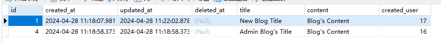

# 2024-BJTU-RESTful-API-Project
> 大三下 ZLG老师 实训课 个人作业
>
> 21301114 俞贤皓

## 1. 简介

### 1.1 技术路线

* 本次大作业使用 GO语言 开发
  * Web框架：gin
  * 数据库ORM：gorm
  * 鉴权工具：jwt
  * 权限工具：gorbac

### 1.2 完成功能

* 我完成了作业要求的 **所有** 基本功能和 **所有额外选作功能**
* 以下列出了我完成功能的基本信息。具体信息请见 **下文的作业内容**
* 作业1
  * 功能点
    * 【完成】用户注册以及登录场景
    * 【完成】博客或内容应用场景
    * 【完成】（额外选作功能）第三方鉴权 API
      * 我使用了jwt鉴权API、gorbac权限管理API
      * 我基于jwt和gorbac，实现了一个权限机制
        * Admin可以读写任何内容
        * User只能读取自己的用户数据（无法访问他人用户数据）
        * User能读取所有博客，但只能修改自己的博客
  * 要求
    * 【完成】Rest API 设计应包括，资源的标识，操作，权限，请求 payload, 应答 payload.
      * 所有API设计均为Restful风格，满足规范
    * 【完成】API 版本控制
      * 资源标识包含了版本信息，如 `v1`
    * 【完成】API 使用说明
      * API文档如文档第二节所示
* 作业2
  * 【完成】实现 restful API 后台应用
  * 【完成】用户鉴权信息需数据库保存
  * 【完成】内容管理信息需数据库保存
  * 建议采用 sping boot + spring security 实现
    * 我使用了 Go + Gin + GoRBAC
  * 【完成】（额外选作功能）第三方鉴权
    * 我使用了 Jwt

## 2. 作业一，RESTful API 设计

### 2.1 用户API

#### 2.1.1 用户注册

* 资源标识：`/api/v1/users`

* 操作：POST

* 权限：无须权限

* 请求Payload

  ```json
  {
      "username": "exampleUser",
      "password": "password",
      "email": "example@email.com",
      "telephone": "10123456789"
  }
  ```

* 响应Payload

  ```json
  {
      "code": 200,
      "message": "Success.",
      "data": {
          "id": "1",
          "username": "exampleUser",
          "password": "password",
          "email": "example@email.com",
          "telephone": "10123456789"
      }
  }
  ```

#### 2.1.2 用户登入

* 资源表示：`/api/v1/sessions`

* 操作：POST

* 权限：无需权限

* 请求Payload

  ```json
  {
      "username": "exampleUser",
      "password": "password"
  }
  ```

* 响应Payload

  ```json
  {
      "code": 200,
      "message": "Success.",
      "data": {
          "user": {
          	"id": "1",
              "username": "exampleUser",
              "password": "password",
              "email": "example@email.com",
              "telephone": "10123456789", 
          },
          "token": "abcdefg1234567890"
      }
  }
  ```

#### 2.1.3 查询所有用户信息

* 资源表示：`/api/v1/users`

* 操作：GET

* 权限：Admin

* 请求Payload

  * 无

* 响应Payload

  ```json
  {
      "code": 200,
      "message": "Success.",
      "data": [
          {
              "id": "1",
              "username": "exampleUser",
              "password": "password",
              "email": "example@email.com",
              "telephone": "10123456789",
          }, {
              ...
          }
      ]
  }
  ```

#### 2.1.4 查询单个用户信息

* 资源表示：`/api/v1/users/{id}`

* 操作：GET

* 权限：Admin

* 参数

  ```json
  "id": "1"
  ```
  
* 请求Payload

  * 无

* 响应Payload

  ```json
  {
      "code": 200,
      "message": "Success.",
      "data": {
          "id": "1",
          "username": "exampleUser",
          "password": "password",
          "email": "example@email.com",
          "telephone": "10123456789"
      }
  }
  ```

### 2.2 博客内容API

#### 2.2.1 添加博客

* 资源表示：`/api/v1/blogs`

* 操作：POST

* 权限：User

* 请求Payload

  ```json
  {
      "title": "title",
      "content": "content"
  }
  ```

* 响应Payload

  ```json
  {
      "code": 200,
      "message": "Success.",
      "data": {
          "id": "1",
          "title": "title",
          "content": "content",
          "createdUser": "username"
      }
  }
  ```

#### 2.2.2 查询单个博客

* 资源表示：`/api/v1/blogs/{id}`

* 操作：GET

* 权限：User

* 参数

  ```json
  "id": "1"
  ```

* 请求Payload

  * 无

* 响应Payload

  ```json
  {
      "code": 200,
      "message": "Success.",
      "data": {
          "id": "1",
          "title": "title",
          "content": "content",
          "createdUser": "username"
      }
  }
  ```

#### 2.2.3 查询所有博客

* 资源表示：`/api/v1/blogs`

* 操作：POST

* 权限：User

* 请求Payload

  * 无

* 响应Payload

  ```json
  {
      "code": 200,
      "message": "Success.",
      "data": [
          {
              "id": "1",
              "title": "title",
              "content": "content",
              "createdUser": "username"
          }, {
              ...
          }
      ]
  }
  ```

#### 2.2.4 更新单个博客

* 资源表示：`/api/v1/blogs/{id}`

* 操作：PATCH

* 权限：对应User

* 参数

  ```json
  "id": "1"
  ```

* 请求Payload

  ```json
  {
      "title": "New title",
      "content": "Updated content"
  }
  ```

* 响应Payload

  ```json
  {
      "code": 200,
      "message": "Success.",
      "data": {
          "id": "1",
          "title": "New title",
          "content": "Updated content",
          "createdUser": "username"
      }
  }
  ```

### 2.3 第三方鉴权API

* 我使用了jwt鉴权API和gorbac权限管理API
* 鉴权：jwt
  * 输入用户数据，由jwt生成token
* 权限管理：gorbac
  * 共分为两种角色：Admin、User
  * Admin可以读写任何内容
  * User只能读取自己的用户数据（无法访问他人用户数据）
  * User能读取所有博客，但只能修改自己的博客

### 2.4 API工具说明

* 我使用了ChatGPT4
* 我的Prompt：作业要求 + “请给你给我一个大概的思路和文档框架。并举一个接口作为例子”
* **GPT4提供了用户注册和登入的接口**
* 通过观察GPT4提供的文档框架、例子，**我自己补全了其他的接口**

## 3. 作业二，RESTful API 后端设计与实现

### 3.1 技术路线

* 我使用Go语言、Gin框架、Gorm数据库API、Jwt鉴权API、GoRBAC权限管理API

### 3.2 数据库表

* 目前共分为两张表：Users、Blogs
* Users（包含用户鉴权信息）
  * 表结构：
  * 表内容：
* Blogs（包含内容管理信息）
  * 表结构：
  * 表内容：

### 3.3 第三方鉴权

* 本项目的鉴权按照如下思路实现
  * 用户必须要登入，获取对应token
  * 请求必须将token置入请求头中
    * 
  * 每个请求，先解析Token，再检查用户角色和权限，最后查看是否满足特殊权限要求（比如User只能修改自己创建的Blog）
    * 
  * 权限管理：gorbac
    * 共分为两种角色：Admin、User
    * Admin可以读写任何内容
    * User只能读取自己的用户数据（无法访问他人用户数据）
    * User能读取所有博客，但只能修改自己的博客

### 3.4 AI工具

* 我是Go语言初学者，所以我让ChatGPT4搭建了一个单文件的Go/Gin框架，然后我在他的帮助下一步一步拓展出基本的Go语言后端框架
* ChatGPT4实现了我第一次见到的功能
* 只要一个功能我已经见过类似的代码，那么这个功能就全部由我独立完成
* 例如Blog模块，所有的Blog代码（model、handler、services）均由我自己实现
* 此外，我对ChatGPT写的代码进行了整理和重构，使得代码更具有可读性

## 4. 作业三，博客 前端的实现

## 5. 作业四，作业二/三 集成测试的实现
